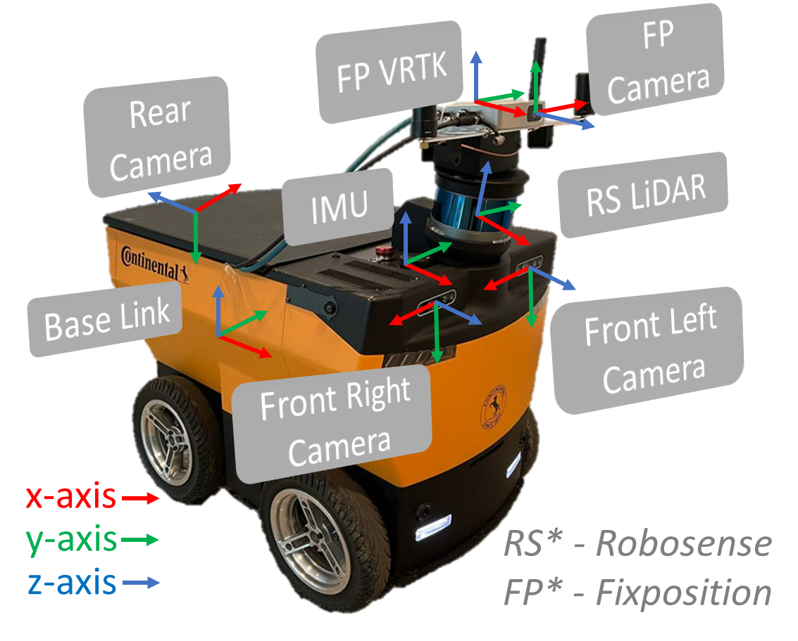
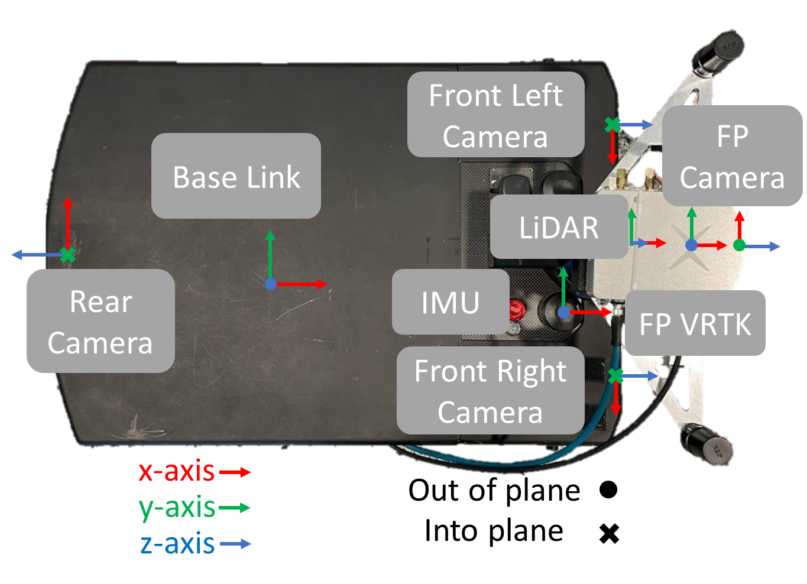

    

# [Continental-NTU Dataset](https://ntu-conti-a2.github.io/Continental-NTU-Dataset) 

 *Visit the Dataset Website [here](https://ntu-conti-a2.github.io/Continental-NTU-Dataset)!* 
 

## Introduction
The Continental-NTU dataset consists of data that was collected using a prototype food delivery robotic platform that was developed by Continental. The robotic platform is equipped with a 16 lines 3-D LiDAR, two front facing RGB-D cameras, a rear facing RGB-D camera, an inertial measurement unit, and a global positioning system.

The data is collected from planned routes within Nanyang Technological University of Singapore (NTU) to include different urban settings, such as campus and residential areas, and in different environment lighting. We would make an effort to include different type of pedestrians pavement to allow for robust models for identification and classification.  
 

    
    
    

 

## Sensors Setup
*Note that the LiDAR sensor is tilted slightly forward (towards the ground), and the x-axis is slightly off-center.*

    
    

    

More information about the sensors will be released ...  
 

## Downloads
**Currently, dataset has not been released. (projected 3/2023)**

The dataset will be published in iterations.  
- v.1 only includes raw data from sensors
- v.2 includes annotations for images
